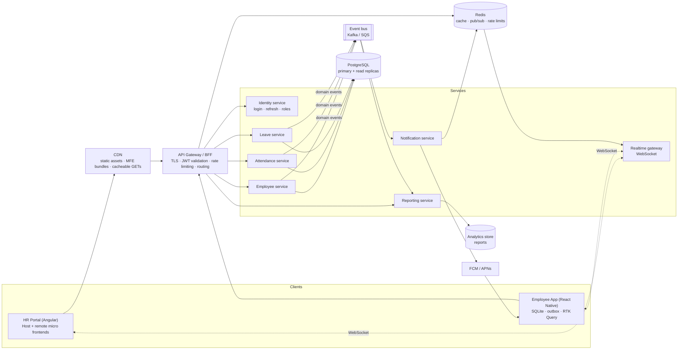
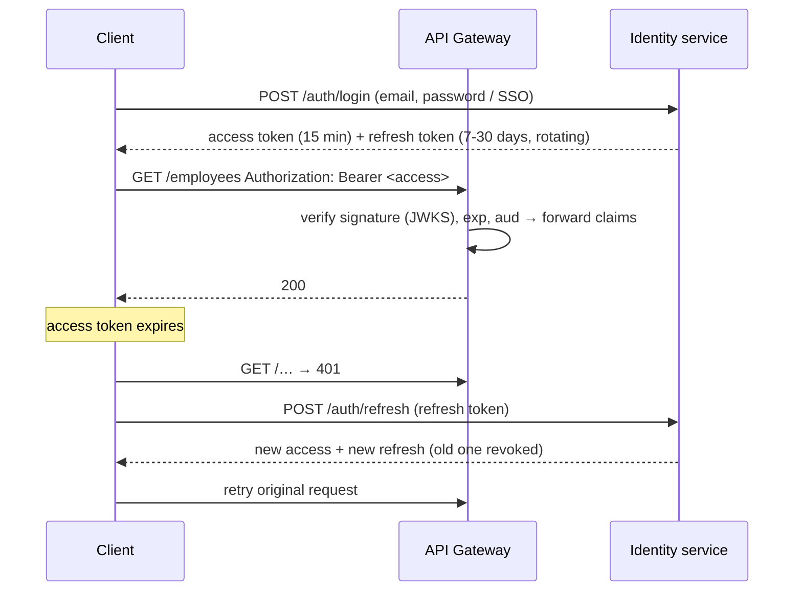
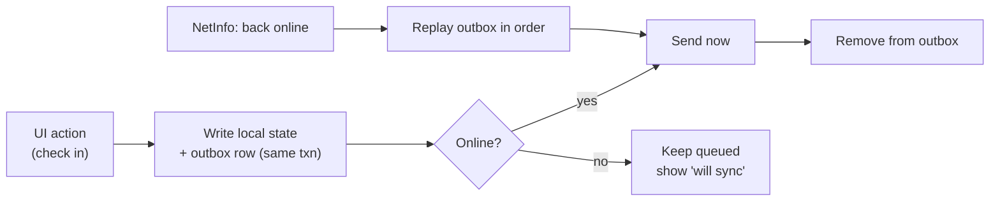
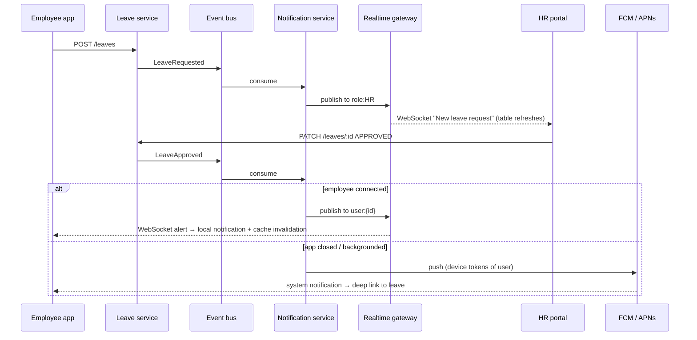
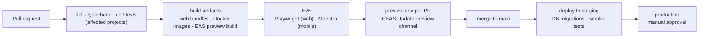

# End-to-End Employee Management Platform — System Design

**Web (Angular):** HR dashboard · employee administration · reports · role-based access
**Mobile (React Native):** employee login · attendance · leave management · notifications
**Cross-cutting:** JWT authentication · role-based authorisation · offline mobile · push notifications · API caching · WebSocket alerts · CI/CD

> A working vertical slice of this design is implemented in this repository. The last section
> maps each requirement to the code.

---

## 1. High-level architecture



**Principles**

- Services are split by business capability. Each owns its data, and they communicate
  asynchronously through **domain events** (`LeaveRequested`, `LeaveApproved`,
  `AttendanceRecorded`).
- **The server is the authority** for authorisation, validation and business rules. Clients
  enforce roles only to shape the UX.
- The mobile app is **offline-first**: it reads from a local store and queues writes. The web
  app is **online-first** with aggressive caching.
- Start as a **modular monolith** (one deployable, strict module boundaries, one database with a
  schema per module) and split services out when scale or team autonomy demands it. The diagram
  shows the target state.

## 2. Authentication (JWT)



- **Access token**: short-lived JWT signed with RS256, holding `sub`, `roles`, `employeeId`,
  `tenant` and `exp`. Services verify it statelessly with the identity service's public keys
  (JWKS), which makes key rotation painless.
- **Refresh token**: opaque and rotating. It is stored server-side as a hash, so a reused token
  revokes the whole token family (theft detection). Logout and password changes revoke it too.
- **Storage**
  - **Web**: an `HttpOnly`, `Secure`, `SameSite=Strict` cookie issued by a BFF on the same
    parent domain. JavaScript never sees tokens, which mitigates XSS token theft. CSRF is covered
    by `SameSite` plus a CSRF header on mutations.
  - **Mobile**: iOS Keychain / Android Keystore via SecureStore, with optional biometric unlock.
- **Refresh coordination**: a single in-flight refresh per client, so concurrent 401s share it.
- **SSO**: OIDC (Azure AD / Okta) for HR staff. The identity service federates and issues the
  same token format, so downstream services don't change.

## 3. Role-based authorisation

| Role | Web | Mobile | API examples |
| --- | --- | --- | --- |
| `EMPLOYEE` | – | Own attendance, own leave, notifications | `GET /attendance/me`, `POST /leaves` |
| `MANAGER` | Team view, approve team leave | Same as employee + approvals | `PATCH /leaves/:id` (own reports only) |
| `HR` | Dashboard, employees, reports, all approvals | – | `GET /reports/*`, `PATCH /leaves/:id` |
| `ADMIN` | Everything + user/role admin | – | `PUT /employees/:id`, role management |

- **Server**: roles are coarse permissions checked by gateway or service middleware
  (`authorize('HR','ADMIN')`). **Row-level rules** live in the service layer: a manager may only
  approve leave for their own reports. Every mutation is written to an **audit log** (who, what,
  before and after).
- **Web**: route guards use `canMatch`, so users without the role never download the code
  (including whole micro frontends). A `*hasRole` directive hides actions.
- **Mobile**: the navigation tree is built from the roles in the token.
- If requirements grow into fine-grained attributes (department, location), move to
  permission-based checks (`leave:approve`) or a policy engine such as OPA or Cedar, without
  touching client code.

## 4. Web application (Angular)

- A **micro-frontend shell** (host) owns login, layout, navigation, live alerts and the dashboard.
  Domain areas such as Employee Administration, Reports and Payroll are **remotes** built and
  deployed independently by their teams and composed at runtime through a federation manifest.
  A remote that fails to load degrades to a fallback without taking the shell down.
- A shared, versioned library (`@acme/shared`) provides auth, guards, HTTP interceptors and the
  design system, loaded as a singleton.
- **State**: signals for local/UI state, NgRx for complex shared domain state (e.g. the employee
  admin grid with optimistic edits), and RxJS for streams.
- **Reports**: served by a reporting service over a read-optimised store (materialised views or a
  warehouse). Large exports are generated asynchronously and delivered by link, never built in
  the request path.
- **Performance**: OnPush, virtual scrolling for large grids, lazy routes, `@defer` for heavy
  widgets such as charts.

## 5. Mobile application (React Native)

- Screens: login, today's attendance (check-in/out), attendance history, leave balance and
  requests, notifications inbox, profile.
- **State**: RTK Query for server data, Redux slices for session and UI, SQLite for offline data.

### Offline support



- **Reads**: cached server data (RTK Query persisted plus SQLite for large sets such as the
  directory). The app is fully usable offline for viewing.
- **Writes**: go to an **outbox** table in the same transaction as the local change, and are
  replayed in order on reconnect.
- **Idempotency**: every write carries an idempotency key (a client-generated UUID or a natural
  key like employee + date for attendance), so replays never duplicate.
- **Original time**: offline actions carry the device time when they happened. The server stores
  both `occurredAt` and `receivedAt`, and flags implausible clock skew.
- **Conflicts**: optimistic concurrency via a `version` field (`409 Conflict` with the current
  server copy). Policy per entity: server-wins with user notification for profile fields,
  append-only for attendance events, and no offline approvals (approvals need an online
  decision).
- **Delta sync**: `GET /resource?updatedSince=<cursor>` with a server-issued cursor, which avoids
  device clock problems. Soft deletes (tombstones) propagate removals.

### Attendance integrity (optional hardening)

A geofence check at check-in (location within the office radius), device attestation (Play
Integrity / App Attest), and server-side anomaly rules (for example, impossible travel).

## 6. Real-time: WebSocket alerts and push notifications



- **Realtime gateway**: WebSocket servers authenticate on connect with the JWT and subscribe the
  connection to channels `user:{id}` and `role:{role}`. They are stateless, and fan-out goes
  through **Redis pub/sub** (or a managed service such as API Gateway WebSockets, Ably or Pusher),
  so any instance can deliver to any user. Horizontal scaling needs no sticky sessions beyond the
  single connection.
- **Client resilience**: heartbeats, exponential back-off with jitter, and on reconnect a
  **backfill** of missed events via `GET /notifications?since=`. Events carry ids for
  de-duplication.
- **Push notifications**
  - **Registration**: on login the app obtains the device token and registers it
    (`POST /devices`) against the user, platform and app version. Tokens are refreshed on each
    launch and removed on logout or when FCM/APNs reports them invalid.
  - **Delivery**: the notification service batches sends through FCM (Android) and APNs (iOS),
    with retries and dead-lettering. Payloads carry only ids and a deep link, never sensitive
    data; the app fetches details after authenticating.
  - **Preferences**: per-category opt-in, quiet hours and rate limiting to avoid spam.
- **Events include a `resource` hint** (`leave`, `attendance`), so clients invalidate exactly the
  cached data that changed.

## 7. API caching

| Layer | What | How |
| --- | --- | --- |
| Client (mobile) | Server state | RTK Query: de-duplication, `keepUnusedDataFor`, tag invalidation, `refetchOnReconnect`; SQLite for offline sets |
| Client (web) | Server state | NgRx entity cache / `shareReplay` caches with explicit invalidation; HTTP cache honoured |
| HTTP | Conditional requests | `ETag` + `If-None-Match` → `304`; `Cache-Control: private, max-age=60` for user data |
| CDN | Static + public reads | Immutable hashed assets (`max-age=31536000, immutable`); short-TTL public reference data |
| Gateway / service | Hot reads | Redis cache-aside for reference data (departments, holidays, leave policies) and report aggregates; TTL plus **event-driven invalidation** from the bus |
| Database | Read load | Read replicas for reporting and list endpoints; materialised views for dashboards |

Rules: never cache authorisation decisions beyond the token lifetime; include the tenant and user
in cache keys for personalised data; prefer invalidation on write events over short TTLs for
correctness.

## 8. Data model (core)

```
employee(id, tenant_id, manager_id, department_id, name, email, phone, designation, location,
         status, version, updated_at, deleted_at)
user(id, employee_id, email, password_hash | idp_subject, roles[], mfa, last_login_at)
attendance_event(id, employee_id, type[CHECK_IN|CHECK_OUT], occurred_at, received_at,
                 source[MOBILE|WEB|DEVICE], geo, idempotency_key UNIQUE)
attendance_day(employee_id, date, first_in, last_out, worked_minutes, status)   -- derived
leave_policy(id, tenant_id, type, annual_quota, carry_forward, …)
leave_balance(employee_id, type, year, available, used)
leave_request(id, employee_id, type, from, to, reason, status, approver_id, version, idempotency_key)
notification(id, recipient_user_id | role, category, title, body, resource, created_at, read_at)
device(id, user_id, platform, push_token, app_version, last_seen_at)
audit_log(id, actor_id, action, entity, entity_id, before, after, at)
```

Attendance is **append-only events**, with the daily summary derived from them. This keeps
offline replays idempotent and makes history auditable.

## 9. CI/CD strategy

**Repository**: a monorepo (Nx or Turborepo) with `apps/hr-portal-host`, `apps/hr-remote-*`,
`apps/mobile`, `services/*` and `libs/shared-*`. Affected-only builds keep pipelines fast.
Independent deploys stay possible because each app has its own pipeline and artifact.



- **Web (micro frontends)**
  - Each remote builds to immutable, content-hashed assets on the CDN.
  - Release: update that environment's **federation manifest** (a config change, no host
    rebuild).
  - Rollback: point the manifest back at the previous version.
  - Canary: serve a different manifest to a percentage of users.
- **Services**
  - Docker images are deployed to Kubernetes/ECS with rolling or blue-green deploys, health
    checks and automatic rollback on error-rate SLO breach.
  - Database migrations are **expand/contract**, so old and new versions run side by side.
- **Mobile**
  - **EAS Build** for binaries (store submission via **EAS Submit** / fastlane), with signing
    credentials held in EAS.
  - **EAS Update** for JavaScript-only fixes, through channels (`preview`, `staging`,
    `production`) and **staged rollouts** gated on Sentry crash-free rate.
  - Native changes bump the runtime version, so OTA updates never reach incompatible binaries.
- **Quality gates**: coverage thresholds on core logic, bundle-size budgets, Lighthouse CI for the
  portal, dependency and SAST scans (Dependabot, CodeQL), and container image scanning.
- **Configuration**: environment-specific config and secrets from a secrets manager. Feature flags
  (LaunchDarkly / Unleash) decouple deploy from release.

## 10. Non-functional concerns

- **Security**: TLS everywhere, OWASP ASVS controls, rate limiting and lockout on login, MFA for
  HR/Admin, encryption of PII at rest, least-privilege service credentials, and certificate
  pinning on mobile for high-risk tenants.
- **Privacy/compliance**: data residency per tenant, retention policies for location/attendance
  data, consent for location tracking, and GDPR export and delete.
- **Observability**: structured logs with a request id propagated from clients, distributed tracing
  (OpenTelemetry), RED metrics, SLOs (e.g. 99.9% availability, p95 < 300 ms for reads), and
  real-user monitoring on web and mobile.
- **Scalability**: stateless services autoscale horizontally; Redis and a CDN absorb read load;
  queues decouple spiky work (month-end reports, notification fan-out); multi-tenant data is
  partitioned by `tenant_id`.
- **Resilience**: timeouts, retries with back-off, circuit breakers, dead-letter queues, and
  graceful degradation (the portal works if reports are down; the mobile app works offline).

## 11. What is implemented in this repository

| Requirement | Implementation |
| --- | --- |
| JWT authentication | `mock-backend/src/http/routes/auth.routes.ts` (access + refresh); web `mfe/projects/shared/src/lib/auth/*` (session, interceptor with single-flight refresh); mobile `rn-app/src/features/auth/*` (SecureStore) |
| Role-based authorisation | Server `authorize()` middleware; web `roleGuard` with `canMatch` + `*acmeHasRole`; HR-only leave approvals and reports |
| HR dashboard, reports | `mfe/projects/host` — dashboard with headcount report, leave approvals |
| Employee administration | `mfe/projects/employee` remote — list, edit with optimistic concurrency (409 handling) |
| Mobile login, attendance, leave, notifications | `rn-app/src/features/hr/*` |
| Offline mobile support | SQLite outbox for attendance and employee edits; delta sync; conflict handling |
| Push notifications | WebSocket alerts surfaced as local notifications (`expo-notifications`); remote FCM/APNs flow as described in section 6 |
| API caching | RTK Query tags and invalidation driven by server events; `shareReplay` caches and NgRx entity cache on web |
| WebSocket alerts | `mock-backend/src/realtime/*` with user- and role-targeted channels and backfill; host live alerts; mobile alert feed |
| CI/CD strategy | Section 9 (design) |

**Demo flow**
1. Sign in to the mobile app as `employee@acme.test` and apply for leave.
2. The HR portal (`hr@acme.test`, `http://localhost:4300/leave-approvals`) shows it instantly.
3. Approve it on the portal.
4. The phone receives an alert and its leave list refreshes to *Approved*.
